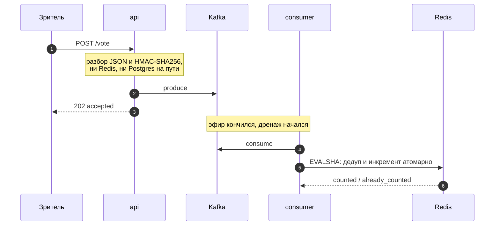
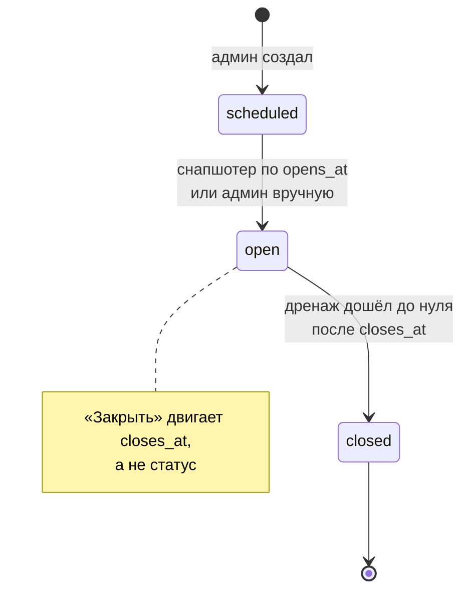

# Televote

Анонимное голосование под пик ТВ-эфира: минутный ролик, 100 млн зрителей,
QR-код на экране. Без регистрации, с дедупликацией.

## Запуск

```bash
make demo
```

```
Голосование   http://localhost:8080/p/demo
QR-код        http://localhost:8080/p/demo/qr.png
Админка       http://localhost:8080/admin      admin / dev-only-change-me
Grafana       http://localhost:3000/d/televote
```

Нужен Docker с 6 ГБ памяти и порты 8080–8082, 3000, 55432. Порт занят —
`APP_PORT=9090 make demo`. Остановить: `make down`.

| Команда | Что проверяет |
|---|---|
| `make smoke` | дедуп между инстансами: один голосующий, два инстанса, один голос |
| `make test` | unit с детектором гонок |
| `make test-integration` | Postgres и Lua-скрипт на настоящем Redis |
| `make load` | k6: стоимость голоса и сверка агрегата |
| `make chaos` | отказ Redis, ребаланс консьюмеров, падение Postgres |
| `make lint` | golangci-lint в докере, версия из CI |

`make load` и `make chaos` заканчиваются сверкой счётчиков с числом принятых
голосов: потерю в пайплайне тест на латентность не увидел бы.

## Архитектура


**ТЗ не требует, чтобы результат был виден сразу.** Значит в окне эфира жёстко
требуется одно: принять голоса и не потерять. Дедуп и подсчёт отложимы — это и
определило форму системы.

| | Синхронный подсчёт | Приём в Kafka |
|---|---|---|
| Мастеров Redis | 32 | **3** |
| Подов приёма | ~100 | **29** |
| Отказ Redis на минуту | **потерянный эфир** | поздний результат |

Ёмкость считает `domain.CapacityFor` из `expected_audience`: дренаж за 5 минут —
3 мастера Redis, за минуту — 13.



Ответ `202`, а не `200`: голос принят к обработке, посчитает его консьюмер.

**Голос — инкремент, а не строка.** Нужен обезличенный агрегат, поэтому 30 млн
голосов — счётчики по числу вариантов. Отдельных голосов нет нигде, связь
«человек → выбор» неоткуда взять. Цена: пересчитать результат позже нельзя.

```lua
if redis.call('SET', KEYS[1], '1', 'NX', 'EX', ARGV[1]) == false then return 2 end
for i = 2, #ARGV do redis.call('HINCRBY', KEYS[2], ARGV[i], 1) end
redis.call('HINCRBY', KEYS[2], 'b', 1)
redis.call('EXPIRE', KEYS[2], ARGV[1])
```

Один вызов даёт корректность при любой балансировке, один RTT вместо двух и
идемпотентность. Последнее обязательно: Kafka доставляет at-least-once, и без
него каждый ребаланс завышал бы результат. Дедуп-ключ и счётчик лежат в одном
слоте благодаря общему hash tag `{p:<pollID>:s<shard>}` — иначе `EVALSHA` вернёт
`CROSSSLOT`, и голос пропадёт молча.



Прямой перевод в `closed` выбросил бы опрос из выборки снапшотера, и голоса
последних секунд пропали бы.

### Устойчивость

| Отказ | Что происходит |
|---|---|
| Redis недоступен | приём идёт, голоса ждут в Kafka, консьюмер ретраит |
| Redis отказывает подряд | circuit breaker размыкает цепь, повтор позже |
| Postgres недоступен | приём его не касается, конфиги из последнего снимка |
| Kafka недоступна | `503` с `Retry-After` — клиенту не врут |
| Реплика консьюмера упала | ребаланс переигрывает, идемпотентность не удваивает |

Временная ошибка Redis никогда не приводит к потере голоса: консьюмер ретраит,
пока жив контекст, и держит партицию. `/readyz` проверяет зависимости роли: у
приёма Kafka, у консьюмера и снапшотера Redis и Postgres — иначе падение
Postgres увело бы все поды приёма из балансировщика.

**Автоскейлинг** — про Kubernetes; на docker-compose реплики фиксированные.
Сервис отдаёт `/internal/capacity` для KEDA, но к приёму автоскейлинг
неприменим: петля HPA от 60 секунд до трёх минут, а ролик длится 60 — ёмкость
поднимается по расписанию эфира.

### Структура

```
cmd/{api,consumer,snapshot,migrate}

internal/
  domain     сущности, voterID, правила выбора, FSM, агрегат, расчёт ёмкости
  service    consumer, snapshot, pollcfg, capacity, auth
  transport  httpapi — входящие адаптеры: роутер, хендлеры, web/
  adapter    postgres, redis, producer — исходящие адаптеры
  platform   app, config, metrics, observability, health, httpx
```

Зависимости направлены внутрь: `internal/domain` не импортирует ничего из
проекта, сервисы не знают `rueidis`/`pgx`, хендлеры — `rueidis`/`pgx`/`kgo`;
всё это проверяет `depguard`. Три роли — три бинаря: приём растёт под пик
эфира, консьюмеры — под consumer lag, снапшотер не растёт вообще. Стенд
поднимает ту же топологию.

Стек: Go 1.26, `franz-go`, `rueidis`, `pgx/v5`, `chi`, OpenTelemetry →
`grafana/otel-lgtm`. Своими руками написана только бизнес-логика: Lua-скрипт,
вывод `voterID` солью опроса, шардирование ключей, снапшотер, функция ёмкости.
Код без комментариев намеренно.

## API

```bash
curl -X POST localhost:8080/api/v1/polls/demo/vote \
  -H 'Content-Type: application/json' \
  -d '{"choices":[1],"voter":"6f8a4c2e-1a3d-4b5c-8d7e-0f1a2b3c4d5e"}'
```

`voter` — случайный идентификатор из `localStorage`; сервер выводит из него ключ
дедупа, хэшируя солью опроса.

| Метод | Путь | Что делает |
|---|---|---|
| `GET` | `/api/v1/polls/{slug}` | вопрос и варианты, кэшируется на CDN |
| `POST` | `/api/v1/polls/{slug}/vote` | принять голос |
| `GET` | `/p/{slug}`, `/p/{slug}/qr.png` | страница 2.5 КБ gzip и QR-код |
| `POST` | `/api/v1/admin/login` | JWT |
| `GET`, `POST` | `/api/v1/admin/polls` | список и создание |
| `POST` | `/api/v1/admin/polls/{slug}/open`, `/close` | открыть, закрыть приём |
| `GET` | `/api/v1/admin/polls/{slug}/results` | обезличенные результаты |

Результаты возвращают `final: false`, пока идёт подсчёт. Проценты считаются от
числа бюллетеней: при множественном выборе сумма голосов больше числа
проголосовавших.

Коды: `202` принят · `400` неверный выбор или `voter` · `401`/`403` нет токена
или датацентровый адрес · `404`/`409` нет опроса или голос вне окна ·
`429`/`503` частота или Kafka недоступна.

## Дедупликация

| Слой | Останавливает | Обходится |
|---|---|---|
| `localStorage` и хэш солью опроса | F5, закрытие вкладки, двойной клик | инкогнито, другой браузер |
| `SET NX` в Lua | повтор тем же идентификатором | новым идентификатором |
| Лимит частоты по префиксу /64 | наивный скрипт | прокси |
| ASN-фильтр датацентров | скрипт с VPS | резидентные прокси |

ТЗ просит защиту «на уровне обычных, не технически подкованных пользователей».
Слои останавливают человека с F5, но не скрипт на двадцать строк — это
соответствие требованию, а не недоработка. **Fingerprint не используется** ни
как ключ, ни как сигнал: 18 бит энтропии против 30 млн голосующих дают потерю
99 %, причём отказы смещены по демографии.

## Допущения

- **Конверсия 30 %** — в ТЗ её нет. Задаётся пер-опрос полем `expected_audience`:
  ошибка меняет число нод, а не решения.
- **Результат нужен eventually** — ТЗ не задаёт времени. Дренаж 5 минут.
- **Половина трафика в первые 15 секунд** — зрители сканируют QR сразу.
- **Один регион.** Глобальное распределение — это CDN и edge.

## Наблюдаемость

`GET /metrics`, трейсы и логи по OTLP, дашборд заводится сам:
<http://localhost:3000/d/televote>.

| Метрика | Смысл |
|---|---|
| `televote_votes_accepted_total` | принято на входе |
| `televote_votes_rejected_total` | отвергнуто, лейбл `reason` |
| `televote_votes_counted_total` | `counted` или `already_counted` |
| `televote_produce_duration_seconds` | бюджет ответа клиенту |
| `televote_apply_duration_seconds` | один `EVALSHA` в Redis |
| `televote_consumer_lag` | ноль означает конец дренажа |
| `televote_ballots_total` | бюллетеней в последнем снимке |
| `televote_http_requests_total` | запросы по маршруту и статусу |
| `televote_redis_breaker_open` | брейкер перед Redis разомкнут |
| `televote_poll_config_age_seconds` | возраст последнего обновления конфигов |

Трейс сшивает приём и подсчёт: контекст едет в заголовках записи Kafka. Лога на
каждый запрос нет намеренно — при 2M RPS это терабайты; в лог идут ошибки и
отклонённые голоса.

## Нагрузочный тест

```
принято 19 000 · посчитано 19 000 · потерь нет
RPS ~310 (упирается в генератор) · p50 0.5 · p95 0.9 · p99 1.6 мс
```

Прогон на ноутбуке, генератор делит CPU с сервисом — цифры нижняя граница.
Переносится не абсолютный RPS, а стоимость единицы работы: отсюда линейно 29
подов на 2M RPS. Не проверено: реальные 2M RPS, потолок Lua в Redis, ложные
failover при `cluster-node-timeout 5s`.

## Что можно улучшить

- **Приём на CDN edge** — `/vote` не имеет состояния до Kafka.
- **Turnstile** — единственное, что меняет порядок стоимости накрутки; не взят,
  добавляет зависимость от Cloudflare.
- **k8s-манифесты** — KEDA и Karpenter описаны, `/internal/capacity` реализован,
  но YAML не написан: непроверенный манифест хуже отсутствующего.

## Артефакты работы с ИИ

Проектирование шло диалогом с Claude Opus: разбор ТЗ, расчёты нагрузки, поиск
корнер-кейсов. Часть кода написана агентами, часть — вручную по написанным
тестам.

**Где рассуждение ошибалось.** Первая версия при недоступности Redis складывала
голоса в память инстанса и отвечала `200` — буфер волатилен, OOM уносит его
целиком, а человеку уже сказали, что голос учтён; заменено на Kafka. Конфиг
опроса предлагалось держать в Redis — пересчёт показал 50 запросов в секунду к
реплике Postgres. Fingerprint отвергнут дважды.

**Что нашли инструменты, а не рассуждение.** Нагрузочный тест нашёл потерю
голосов: консьюмер отбрасывал сообщение, если кэш конфигов ещё не знал про
свежесозданный опрос, — и коммитил оффсет. Прогон в браузере нашёл, что
результаты закрытого опроса отдавали 500. Ревью кода нашло, что `IsRetryable` не
распознавал `-READONLY` и `-OOM`: при failover мастера Redis голоса выбрасывались
без ретрая. CI поймал то, что не воспроизводилось локально: `make demo` не ждал
балансировщик и падал на холодной машине.
