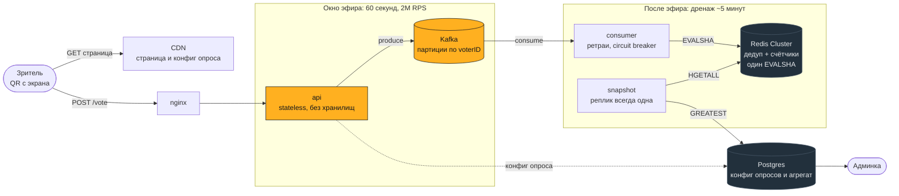

# Televote

Сервис анонимного голосования под пик ТВ-эфира: минутный ролик, 100 млн
зрителей, QR-код на экране. Без регистрации, с дедупликацией.

## Запуск

```bash
make demo
```

Поднимает стенд, дожидается готовности, создаёт демо-опрос и печатает ссылки:

```
Голосование   http://localhost:8080/p/demo
QR-код        http://localhost:8080/p/demo/qr.png
Админка       http://localhost:8080/admin      admin / dev-only-change-me
Grafana       http://localhost:3000/d/televote
```

Нужен Docker с 6 ГБ памяти и свободные порты 8080–8082, 3000, 55432. Порт
занят — `APP_PORT=9090 make demo`. Первый запуск 2–4 минуты, дальше около
минуты. Остановить и стереть данные: `make down`.

### Проверки

```bash
make smoke              # end-to-end, включая дедуп между двумя инстансами
make test               # unit с детектором гонок
make test-integration   # на настоящих Postgres и Redis через testcontainers
make load               # k6: стоимость голоса и сверка агрегата
make chaos              # отказ Redis, ребаланс консьюмеров, падение Postgres
make lint               # golangci-lint в докере, версия та же, что в CI
```

`make smoke` доказывает главное требование: один голосующий отправляет голос на
**два разных инстанса**, и после дренажа в результатах оказывается **ровно
один** голос. `make load` и `make chaos` заканчиваются сверкой суммы счётчиков
с числом принятых голосов — потерю в пайплайне тест на латентность не увидел бы.

## API

### Публичный

**`GET /api/v1/polls/{slug}`** — вопрос и варианты. Кэшируется на CDN: конфиг
одинаков для всех 30 млн зрителей.

```json
{
  "slug": "demo", "question": "Кто победит в финале?",
  "options": ["Первый", "Второй", "Третий"],
  "type": "single", "min_choices": 1, "max_choices": 1,
  "opens_at": "2026-09-08T20:47:30Z", "closes_at": "2026-09-08T20:48:30Z",
  "server_time": "2026-09-08T20:47:44Z"
}
```

`server_time` нужен клиенту: у зрителя часы могут врать.

**`POST /api/v1/polls/{slug}/vote`** — проголосовать.

```bash
curl -X POST localhost:8080/api/v1/polls/demo/vote \
  -H 'Content-Type: application/json' \
  -d '{"choices":[1],"voter":"6f8a4c2e-1a3d-4b5c-8d7e-0f1a2b3c4d5e"}'
```

```json
{"status": "accepted"}
```

`voter` — случайный идентификатор, который браузер держит в `localStorage`.
Сервер выводит из него ключ дедупа, хэшируя солью опроса.

**`GET /p/{slug}`** — страница голосования, 2.5 КБ gzip без внешних ресурсов.
**`GET /p/{slug}/qr.png`** — QR-код для экрана телевизора.

### Админский

Все методы требуют `Authorization: Bearer <token>`.

```bash
TOKEN=$(curl -s -X POST localhost:8080/api/v1/admin/login \
  -H 'Content-Type: application/json' \
  -d '{"login":"admin","password":"dev-only-change-me"}' | jq -r .token)

curl -X POST localhost:8080/api/v1/admin/polls \
  -H "Authorization: Bearer $TOKEN" -H 'Content-Type: application/json' \
  -d '{"slug":"final","question":"Кто победит?","type":"single",
       "options":["Первый","Второй"],
       "opens_at":"2026-09-08T20:47:30Z","closes_at":"2026-09-08T20:48:30Z",
       "expected_audience":100000000,"expected_conversion":0.3}'
```

| Метод | Путь | Роль | Что делает |
|---|---|---|---|
| `POST` | `/admin/login` | — | выдаёт JWT |
| `GET` | `/admin/polls` | viewer | список опросов |
| `POST` | `/admin/polls` | editor | создать опрос |
| `POST` | `/admin/polls/{slug}/open` | editor | открыть |
| `POST` | `/admin/polls/{slug}/close` | editor | закрыть приём: сдвигает `closes_at` на сейчас |
| `GET` | `/admin/polls/{slug}/results` | viewer | обезличенные результаты |

Закрытие двигает границу окна, а не статус: статус переведёт снапшотер, когда
дренаж дойдёт до нуля, вместе с публикацией итога. Прямой перевод в `closed`
выбросил бы опрос из выборки снапшотера, и голоса последних секунд пропали бы.

Результаты возвращают `final: false`, пока идёт подсчёт: цифры ещё растут, и
админ обязан это видеть. Проценты считаются от числа **бюллетеней**, а не от
суммы голосов — при множественном выборе сумма больше числа проголосовавших.

| Код | Тело | Когда |
|---|---|---|
| `202` | `accepted` | голос принят к обработке |
| `400` | `invalid_choices` | нарушены `min/max`, неверный индекс, битый `voter` |
| `401` | `unauthorized` | админка без токена или с истёкшим |
| `403` | `blocked` | адрес из датацентрового диапазона |
| `404` | `not_found` | опроса нет или он уже закрыт |
| `409` | `poll_closed` | голос вне окна голосования |
| `429` | — | превышена частота запросов |
| `503` | `unavailable` | Kafka недоступна, `Retry-After` в заголовке |

`202`, а не `200`: голос принят к обработке, посчитает его консьюмер. Отвечать
«посчитан» за то, что ещё лежит в очереди, — значит врать клиенту.

## Архитектура



На горячем пути только приём: разбор JSON, HMAC-SHA256 и запись в батч
продюсера. Ни Redis, ни Postgres на нём нет, поэтому их отказ не останавливает
голосование.


**ТЗ не требует, чтобы результат был виден сразу** — формулировка «посмотреть
результаты опроса», без единого слова о свежести. Значит в окне эфира жёстко
требуется ровно одно: принять голоса и не потерять. Дедуп, подсчёт и агрегация
отложимы. Это решение определило форму системы:

| | Синхронный подсчёт | Приём в Kafka |
|---|---|---|
| Мастеров Redis | 32 | **3** |
| Подов приёма | ~100 | **29** |
| Полный отказ Redis на минуту | **потерянный эфир** | поздний результат |
| Ответ клиенту | `counted` | `202 accepted` |

Ёмкость считает `domain.CapacityFor` из `expected_audience` опроса: дренаж за
5 минут — 3 мастера Redis, за минуту — 13. Линейно.

**Голос — инкремент, а не строка.** Нужен обезличенный агрегат, поэтому 30 млн
голосов — это счётчики по числу вариантов. Отдельных голосов нет нигде, так что
связь «человек → выбор» неоткуда взять. Цена: пересчитать результат позже
нельзя.

**Один атомарный Lua-вызов** — дедуп и инкремент вместе:

```lua
if redis.call('SET', KEYS[1], '1', 'NX', 'EX', ARGV[1]) == false then return 2 end
for i = 2, #ARGV do redis.call('HINCRBY', KEYS[2], ARGV[i], 1) end
redis.call('HINCRBY', KEYS[2], 'b', 1)
```

Отсюда корректность при любой балансировке, отсутствие гонки «дедуп есть,
счётчик нет», один RTT вместо двух и идемпотентность. Последнее обязательно:
Kafka доставляет at-least-once, и без неё каждый ребаланс завышал бы результат.

**Ключи шардируются по `voter_id`.** Дедуп-маркер привязан к голосующему, а
атомарность требует, чтобы счётчик лежал с ним в одном слоте. Отсюда общий hash
tag `{p:<pollID>:s<shard>}` — без него `EVALSHA` вернёт `CROSSSLOT`, и голос не
будет ни посчитан, ни отвергнут: он просто пропадёт.

**Автоскейлинг неприменим к приёму.** Петля HPA — от 60 секунд до трёх минут,
а ролик длится 60 секунд: мощности приедут под трафик, которого уже нет. Вместо
неё ёмкость поднимается по расписанию — `opens_at` известен заранее, KEDA
скейлит по ответу `/internal/capacity`. К консьюмерам автоскейлинг применим:
Kafka сдвинула их дедлайн с 60 секунд до пяти минут.

### Технологии

| Задача | Выбор | Почему |
|---|---|---|
| Язык | Go 1.26 | дешёвые горутины, предсказуемый GC, старт за миллисекунды |
| Приём | `twmb/franz-go` | активно поддерживается, идиоматичен, работает с KRaft |
| Redis | `redis/rueidis` | auto-pipelining и мультиплексирование соединений бесплатно |
| Postgres | `jackc/pgx/v5` | нативный протокол вместо `database/sql` |
| Роутер | `go-chi/chi` | stdlib-совместимый, без магии |
| Наблюдаемость | OpenTelemetry → `grafana/otel-lgtm` | метрики, логи и трейсы одним контейнером |

Не написано своими руками: пайплайнинг Redis, `EVALSHA`/`NOSCRIPT` fallback,
батчинг продюсера, пул соединений, rate limiter, argon2, graceful shutdown.
Написано: Lua-скрипт голосования, вывод `voterID` солью опроса, шардирование
ключей, снапшотер, функция ёмкости — это бизнес-логика, готового нет.

### Трейд-оффы

| Развилка | Выбор | Чем платим |
|---|---|---|
| Синхронный подсчёт vs Kafka | **Kafka** | асинхронный ответ, ещё одна система |
| Длина дренажа | **5 минут** | результат на T+6 мин |
| Дедуп в памяти vs Redis | **Redis** | зависимость в консьюмере, не в запросе |
| Аудит-трейл голосов | **нет** | пересчёт при споре невозможен |
| Fingerprint | **нет** | −один сигнал; энтропии не хватает |
| Автоисключение накрутки | **нет, решает оператор** | нужен человек в контуре |
| k8s-манифесты | **нет** | рассуждение вместо непроверенного YAML |

### Структура

```
cmd/api        приём голосов и админка
cmd/consumer   применение голосов в Redis
cmd/snapshot   Redis → Postgres, расписание, финализация
cmd/migrate    миграции со встроенными SQL

internal/
  domain       сущности, правила выбора, FSM статусов, агрегат, расчёт ёмкости
  service/     прикладной слой
    vote         Lua-скрипт, вывод voterID, шардирование ключей
    consumer     подсчёт голосов, ретраи, circuit breaker
    snapshot     Redis → Postgres, расписание, финализация
    pollcfg      кэш конфигов опросов в памяти процесса
    capacity     советчик ёмкости для KEDA
    auth         argon2id, JWT, роли
  adapter/     внешний мир
    httpapi      приём голоса, админка, страницы
    producer     отправка голоса в Kafka
    postgres     репозитории control plane
  platform/    процесс
    app          сборка зависимостей и жизненный цикл
    config       конфигурация с проверкой инвариантов при старте
    metrics      бизнес-метрики Prometheus
    observability OTLP-экспорт трейсов и логов, trace_id в slog
    health       пробы готовности и живости
    httpx        клиентский IP, лимит частоты, ASN-фильтр, заголовки
```

Моки для интерфейсов генерируются `mockgen` (`make mocks`) и лежат рядом с
пакетом в `mocks/`. Тесты на них проверяют не результат, а взаимодействие:
сколько раз консьюмер дёрнул Redis, дождался ли конфига вместо того, чтобы
выбросить голос, перестал ли ходить в Redis после открытия брейкера.

Зависимости направлены внутрь: `internal/domain` не импортирует ничего из
проекта, и это проверяет `depguard`, а не соглашение.

Три роли — **три бинаря**, потому что у них разные законы масштабирования.
Приём растёт под пик эфира и живёт минуты. Консьюмеры растут под consumer lag
и живут до нуля. Снапшотер не растёт вообще: его работа — fan-in по всем
шардам, N реплик повторяли бы одно и то же N раз. Стенд поднимает ту же
топологию: два `api` за nginx, две реплики `consumer`, один `snapshot`.

Код без комментариев намеренно: имена и сигнатуры несут смысл сами, а всё, что
требует объяснения, объяснено здесь.

### Устойчивость

| Отказ | Что происходит |
|---|---|
| Redis недоступен | приём продолжается, голоса ждут в Kafka; консьюмер ретраит с бэкоффом |
| Redis отказывает подряд | circuit breaker размыкает цепь, консьюмер перестаёт бить в мёртвый узел и повторяет позже |
| Postgres недоступен | приём его не касается; кэш конфигов работает на последнем снимке, снапшоты догоняют после возврата |
| Kafka недоступна | `503` с `Retry-After` — клиенту не врут, что голос принят |
| Реплика консьюмера упала | ребаланс группы переигрывает сообщения, идемпотентность не даёт удвоить счёт |

`GET /livez` — процесс жив, можно не перезапускать. `GET /readyz` — проверяет
настоящие Postgres, Redis и Kafka плюс gate готовности: при остановке инстанс
снимает готовность раньше, чем перестаёт отвечать, и балансировщик успевает
увести трафик. Каждый сценарий из таблицы проверяет `make chaos`.

## Дедупликация

| Слой | Останавливает | Обходится |
|---|---|---|
| `localStorage` + серверный хэш солью опроса | F5, закрытие вкладки, двойной клик | инкогнито, другой браузер |
| `SET NX` в Lua, авторитетно | повтор тем же идентификатором | новым идентификатором |
| Лимит частоты по префиксу /64 | наивный скрипт | прокси |
| ASN-фильтр датацентров | скрипт с VPS | резидентные прокси |

ТЗ просит защиту «на уровне обычных, не технически подкованных пользователей».
Слои останавливают человека с F5 и вкладкой инкогнито, но не скрипт на двадцать
строк — это соответствие требованию, а не недоработка.

**Fingerprint не используется** ни как ключ, ни как сигнал: 18 бит энтропии
против 30 млн голосующих дают потерю 99 %, причём отказы концентрируются на
самых распространённых моделях — то есть смещены по демографии.

## Допущения

- **Конверсия 30 %** — в ТЗ её нет. Задаётся пер-опрос полем
  `expected_audience`, а не константой: ошибка меняет число нод, а не решения.
- **Результаты нужны eventually** — ТЗ не задаёт времени. Дренаж 5 минут.
- **Половина трафика в первые 15 секунд** — зрители сканируют QR сразу.
- **Один регион.** Глобальное распределение — это CDN и edge.
- **Отдельные голоса не хранятся нигде** — только агрегат.

## Наблюдаемость

`GET /metrics`, плюс трейсы и логи уходят по OTLP в Grafana (`otel-lgtm` одним
контейнером). Дашборд заведён автоматически, восемь панелей:
<http://localhost:3000/d/televote>.

| Метрика | Тип | Лейблы | Смысл |
|---|---|---|---|
| `televote_votes_accepted_total` | counter | — | принято на входе |
| `televote_votes_rejected_total` | counter | `reason` | отвергнуто |
| `televote_votes_counted_total` | counter | `result` | `counted` / `already_counted` |
| `televote_produce_duration_seconds` | histogram | — | бюджет ответа клиенту |
| `televote_apply_duration_seconds` | histogram | — | один `EVALSHA` в Redis |
| `televote_consumer_lag` | gauge | — | ноль означает конец дренажа |
| `televote_ballots_total` | gauge | `poll` | бюллетеней в последнем снимке |

Трейс сшивает приём и подсчёт: контекст едет в заголовках записи Kafka, поэтому
HTTP-запрос и применение голоса в Redis минутами позже видны одним трейсом.
В проде сэмплирование 0.01 %, на стенде — всё.

## Нагрузочный тест

Прогон на ноутбуке, генератор делит CPU с сервисом, поэтому цифры — нижняя
граница:

```
принято на входе        19 000     достигнутый RPS    ~310 (упирается в генератор)
посчитано после дренажа 19 000     латентность приёма p50 0.5 · p95 0.9 · p99 1.6 мс
сверка                  сходится — потерь в пайплайне нет
```

Главное здесь не RPS, а первые три строки: потерю в цепочке «приём → Kafka →
консьюмер → Redis → снапшот → Postgres» тест на латентность не увидел бы — все
запросы вернули бы 202, а голоса тихо не доехали бы.

Абсолютный RPS ноутбука не переносится, переносится стоимость единицы работы:
приём голоса — разбор ~80 байт JSON, один HMAC-SHA256 и запись в батч
продюсера, без Redis и Postgres на пути. Отсюда линейно 29 подов на 2M RPS.

Не проверено: реальные 2M RPS (нужен кластер), потолок Lua в Redis (недостижим
на трёх мастерах в Docker), ложные failover при `cluster-node-timeout 5s`.

## Артефакты работы с ИИ

Проектирование шло диалогом с Claude Opus: разбор ТЗ, расчёты нагрузки, перебор
вариантов, поиск корнер-кейсов. Часть кода написана агентами по плану, часть —
вручную по уже написанным тестам. Три попытки прогнать реализацию большими
параллельными воркфлоу (13, 18 и 20 агентов) упёрлись в лимиты и дали мало;
сработали короткие волны и дописывание вручную там, где тесты уже служили
спецификацией.

**Где рассуждение ошибалось.** Первая версия при недоступности Redis складывала
голоса в очередь в памяти инстанса и отвечала `200`: буфер живёт в волатильной
памяти, OOM уносит его целиком — а человеку уже сказали, что голос учтён.
Заменено на Kafka. Конфиг опроса предлагалось держать в Redis — пересчёт
показал 50 запросов в секунду к реплике Postgres, кэш не нужен. Персистентность
Redis предлагалось отключить из-за задержек `fork` — оценка была на монолитный
Redis, при шардировании датасет на ноду мал. Отдельная ручка `POST /ballot`
выдавала подписанный токен — единственное, что она покупала, закрыла серверная
метка Kafka. Fingerprint отвергнут дважды: как ключ дедупа и как сигнал
накрутки. Автоматическое исключение накрутки по порогу отсекло бы крупнейшего
легального оператора за CGNAT.

**Что нашли инструменты, а не рассуждение.** Нагрузочный тест нашёл настоящую
потерю голосов: консьюмер отбрасывал сообщение, если его кэш конфигов ещё не
знал про свежесозданный опрос, — и коммитил оффсет. Он же нашёл дефект в самой
проверке: она опрашивала результаты чаще, чем снапшотер обновляет агрегат, и
сообщала о потере, которой нет. Сквозной прогон в браузере нашёл, что
результаты закрытого опроса отдавали 500, потому что ручное закрытие сразу
переводило опрос в `closed` и снапшотер переставал его видеть; там же — что
закрытый опрос пропадал из списка админки. Агент, писавший каркас, нашёл
неякорный паттерн в `.gitignore`, из-за которого git игнорировал точку входа.

## Что можно улучшить

- **Приём на CDN edge** — `/vote` не имеет состояния до Kafka.
- **Turnstile** — единственное, что меняет порядок стоимости накрутки; не взят,
  добавляет зависимость от Cloudflare.
- **Real-time на студийном экране** — потребует SSE и синхронного подсчёта.
- **Мультирегиональность** — приём в ближайший регион, свёртка в центре.
- **k8s-манифесты** — KEDA и Karpenter описаны, `/internal/capacity` реализован,
  но YAML не написан: непроверенный манифест хуже отсутствующего.

## Облачное соответствие

| Задача | AWS | GCP |
|---|---|---|
| Приём | EKS + Karpenter, ёмкость по расписанию эфира | GKE Autopilot |
| Очередь | MSK | Managed Kafka |
| Счётчики | self-hosted Redis Cluster | self-hosted |
| Control plane | RDS PostgreSQL Multi-AZ | Cloud SQL HA |
| Раздача статики | CloudFront | Cloud CDN |
| Метрики | AMP + AMG | Managed Prometheus |
| Секреты | Secrets Manager | Secret Manager |
