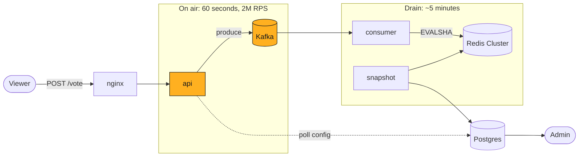
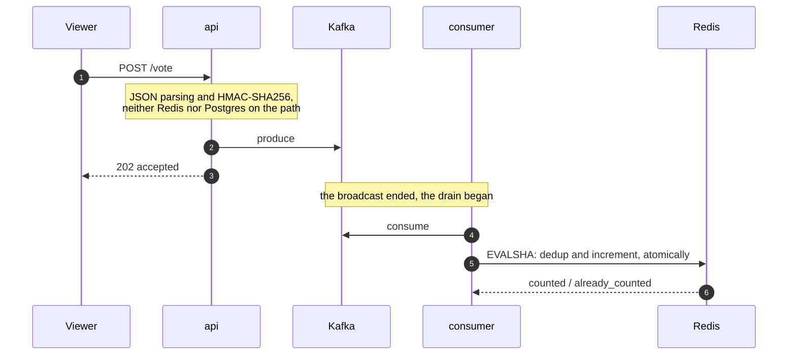
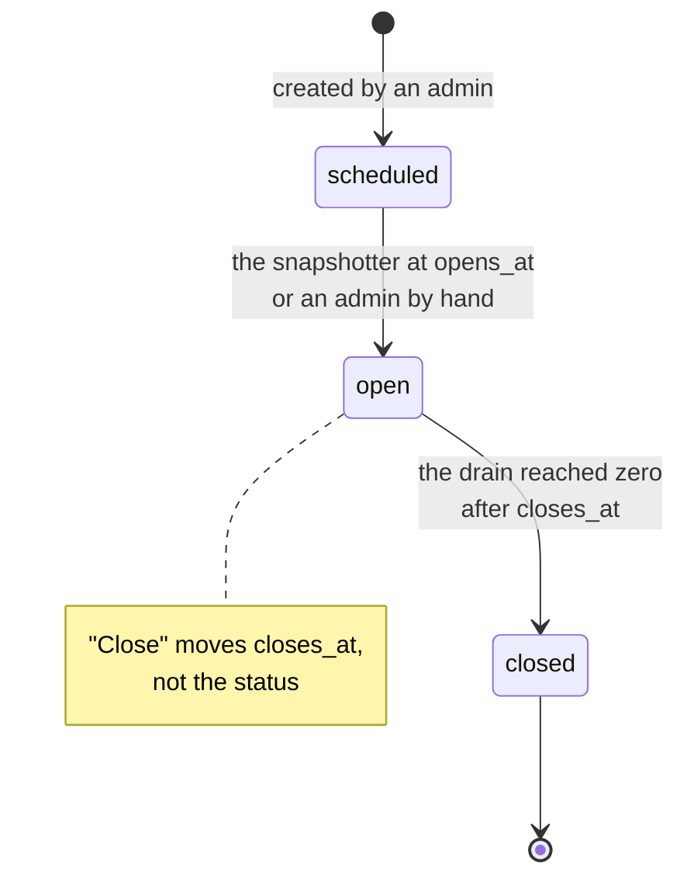

# Televote

Anonymous voting at the peak of a TV broadcast: a one-minute segment, 100M viewers,
a QR code on screen. No sign-up, with deduplication.

## Running it

```bash
make demo
```

```
Voting        http://localhost:8080/p/demo
QR code       http://localhost:8080/p/demo/qr.png
Admin         http://localhost:8080/admin      admin / dev-only-change-me
Grafana       http://localhost:3000/d/televote
```

Needs Docker with 6 GB of memory and ports 8080-8082, 3000, 55432. If a port is taken,
`APP_PORT=9090 make demo`. To stop: `make down`.

| Command | What it checks |
|---|---|
| `make smoke` | dedup across instances: one voter, two instances, one vote |
| `make test` | unit tests with the race detector |
| `make test-integration` | Postgres and the Lua script against a real Redis |
| `make load` | k6: cost per vote and aggregate reconciliation |
| `make chaos` | Redis failure, consumer rebalance, Postgres crash |
| `make lint` | golangci-lint in Docker, the version CI uses |

`make load` and `make chaos` both end by reconciling the counters against the number of
accepted votes: a latency test would not notice a loss inside the pipeline.

## Architecture



**The spec does not require the result to be visible immediately.** So during the broadcast
window exactly one thing is mandatory: accept the votes and lose none of them. Deduplication and
counting can be deferred, and that is what gave the system its shape.

| | Synchronous counting | Accept into Kafka |
|---|---|---|
| Redis masters | 32 | **3** |
| Ingest pods | ~100 | **29** |
| Redis down for a minute | **the broadcast is lost** | a late result |

Capacity comes from `domain.CapacityFor` applied to `expected_audience`: draining in 5 minutes
takes 3 Redis masters, draining in one takes 13.



`202` rather than `200`: the vote has been accepted for processing, the consumer will count it.

**A vote is an increment, not a row.** What is needed is an anonymous aggregate, so 30M votes
become counters, one per choice. Individual votes are not stored anywhere, and there is nowhere
to recover a "person → choice" link from. The price: the result cannot be recomputed later.

```lua
if redis.call('SET', KEYS[1], '1', 'NX', 'EX', ARGV[1]) == false then return 2 end
for i = 2, #ARGV do redis.call('HINCRBY', KEYS[2], ARGV[i], 1) end
redis.call('HINCRBY', KEYS[2], 'b', 1)
redis.call('EXPIRE', KEYS[2], ARGV[1])
```

A single call gives correctness under any balancing, one RTT instead of two, and idempotency.
The last one is mandatory: Kafka delivers at-least-once, and without it every rebalance would
inflate the result. The dedup key and the counter live in the same slot thanks to a shared hash
tag `{p:<pollID>:s<shard>}` — otherwise `EVALSHA` returns `CROSSSLOT` and the vote disappears
silently.



Flipping straight to `closed` would drop the poll out of the snapshotter's selection, and the
votes from the final seconds would be lost.

### Resilience

| Failure | What happens |
|---|---|
| Redis unavailable | ingest continues, votes wait in Kafka, the consumer retries |
| Redis failing repeatedly | the circuit breaker opens, retry later |
| Postgres unavailable | ingest does not touch it, configs come from the last snapshot |
| Kafka unavailable | `503` with `Retry-After` — the client is not lied to |
| A consumer replica dies | the rebalance replays, idempotency prevents double counting |

A transient Redis error never costs a vote: the consumer retries for as long as its context is
alive and holds the partition. `/readyz` checks the dependencies of its own role — Kafka for
ingest, Redis and Postgres for the consumer and the snapshotter — otherwise a Postgres outage
would pull every ingest pod out of the load balancer.

**Autoscaling** is a Kubernetes concern; on docker-compose the replica counts are fixed. The
service exposes `/internal/capacity` for KEDA, but autoscaling does not apply to ingest: an HPA
loop takes between 60 seconds and three minutes, and the segment lasts 60 — capacity is raised
on the broadcast schedule instead.

### Layout

```
cmd/{api,consumer,snapshot,migrate}

internal/
  domain     entities, choice rules, FSM, aggregate, capacity calculation
  service    vote, consumer, snapshot, pollcfg, capacity, auth
  adapter    httpapi, producer, postgres
  platform   app, config, metrics, observability, health, httpx
```

Dependencies point inward: `internal/domain` imports nothing from the project, and `depguard`
enforces it. Three roles, three binaries: ingest scales for the broadcast peak, consumers scale
on consumer lag, the snapshotter does not scale at all. The local stand-up brings up the same
topology.

Stack: Go 1.26, `franz-go`, `rueidis`, `pgx/v5`, `chi`, OpenTelemetry → `grafana/otel-lgtm`.
Only the business logic is hand-written: the Lua script, deriving `voterID` with the poll salt,
key sharding, the snapshotter, and the capacity function. The code carries no comments, deliberately.

## API

```bash
curl -X POST localhost:8080/api/v1/polls/demo/vote \
  -H 'Content-Type: application/json' \
  -d '{"choices":[1],"voter":"6f8a4c2e-1a3d-4b5c-8d7e-0f1a2b3c4d5e"}'
```

`voter` is a random identifier from `localStorage`; the server derives the dedup key from it by
hashing with the poll salt.

| Method | Path | What it does |
|---|---|---|
| `GET` | `/api/v1/polls/{slug}` | the question and its choices, CDN-cacheable |
| `POST` | `/api/v1/polls/{slug}/vote` | accept a vote |
| `GET` | `/p/{slug}`, `/p/{slug}/qr.png` | a 2.5 KB gzipped page and the QR code |
| `POST` | `/api/v1/admin/login` | JWT |
| `GET`, `POST` | `/api/v1/admin/polls` | list and create |
| `POST` | `/api/v1/admin/polls/{slug}/open`, `/close` | open and close ingest |
| `GET` | `/api/v1/admin/polls/{slug}/results` | anonymized results |

Results carry `final: false` while counting is still running. Percentages are computed against
the number of ballots: with multiple choice, the sum of votes exceeds the number of voters.

Status codes: `202` accepted · `400` invalid choice or `voter` · `401`/`403` missing token or a
datacenter address · `404`/`409` no such poll or a vote outside the window · `429`/`503` rate
limit or Kafka unavailable.

## Deduplication

| Layer | Stops | Bypassed by |
|---|---|---|
| `localStorage` plus a poll-salted hash | F5, closing the tab, double click | incognito, another browser |
| `SET NX` inside Lua | a repeat under the same identifier | a new identifier |
| Rate limit per /64 prefix | a naive script | a proxy |
| Datacenter ASN filter | a script on a VPS | residential proxies |

The spec asks for protection "at the level of ordinary, non-technical users". These layers stop
a person hitting F5, but not a twenty-line script — that is compliance with the requirement, not
a gap. **Fingerprinting is not used** either as a key or as a signal: 18 bits of entropy against
30M voters means a 99% loss rate, and the rejections skew by demographic.

## Assumptions

- **30% conversion** — not in the spec. Set per poll through `expected_audience`: getting it
  wrong changes the node count, not the design decisions.
- **The result is needed eventually** — the spec sets no deadline. The drain takes 5 minutes.
- **Half the traffic in the first 15 seconds** — viewers scan the QR immediately.
- **A single region.** Global distribution is a CDN and edge concern.

## Observability

`GET /metrics`, traces and logs over OTLP, the dashboard provisions itself:
<http://localhost:3000/d/televote>.

| Metric | Meaning |
|---|---|
| `televote_votes_accepted_total` | accepted at ingest |
| `televote_votes_rejected_total` | rejected, with a `reason` label |
| `televote_votes_counted_total` | `counted` or `already_counted` |
| `televote_produce_duration_seconds` | the budget for the client's response |
| `televote_apply_duration_seconds` | a single `EVALSHA` in Redis |
| `televote_consumer_lag` | zero means the drain is done |
| `televote_ballots_total` | ballots in the latest snapshot |
| `televote_http_requests_total` | requests by route and status |
| `televote_redis_breaker_open` | the breaker in front of Redis is open |
| `televote_poll_config_age_seconds` | age of the last config refresh |

A trace stitches ingest to counting: the context travels in the Kafka record headers. There is
deliberately no per-request log line — at 2M RPS that is terabytes; errors and rejected votes go
to the log.

## Load test

```
19,000 accepted · 19,000 counted · no loss
RPS ~310 (bounded by the generator) · p50 0.5 · p95 0.9 · p99 1.6 ms
```

Run on a laptop, with the generator sharing CPU with the service — the numbers are a lower bound.
What transfers is not the absolute RPS but the cost of a unit of work: from there, linearly, 29
pods for 2M RPS. Not verified: a real 2M RPS, the ceiling of Lua in Redis, and spurious failovers
at `cluster-node-timeout 5s`.

## What could be better

- **Ingest at the CDN edge** — `/vote` holds no state before Kafka.
- **Turnstile** — the only thing that changes the order of magnitude of the cost of ballot
  stuffing; not taken, it adds a dependency on Cloudflare.
- **k8s manifests** — KEDA and Karpenter are described and `/internal/capacity` is implemented,
  but the YAML is not written: an unverified manifest is worse than none.

## Artifacts of working with AI

The design was worked out in dialogue with Claude Opus: reading the spec apart, load calculations,
hunting corner cases. Part of the code was written by agents, part by hand against tests written
first.

**Where the reasoning was wrong.** The first version buffered votes in instance memory when Redis
was unavailable and answered `200` — the buffer is volatile, an OOM takes all of it, and the
person has already been told their vote counted; replaced with Kafka. Poll config was proposed to
live in Redis; recalculating showed 50 requests per second against a Postgres replica.
Fingerprinting was rejected twice.

**What the tools found, rather than the reasoning.** The load test found lost votes: the consumer
dropped a message when its config cache did not yet know about a freshly created poll — and
committed the offset anyway. A browser run found that results for a closed poll returned 500.
Code review found that `IsRetryable` did not recognize `-READONLY` and `-OOM`: during a Redis
master failover, votes were discarded without a retry. CI caught what did not reproduce locally:
`make demo` did not wait for the load balancer and failed on a cold machine.
