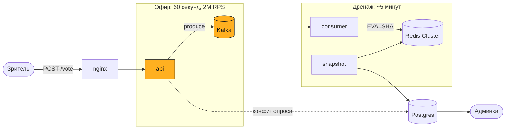
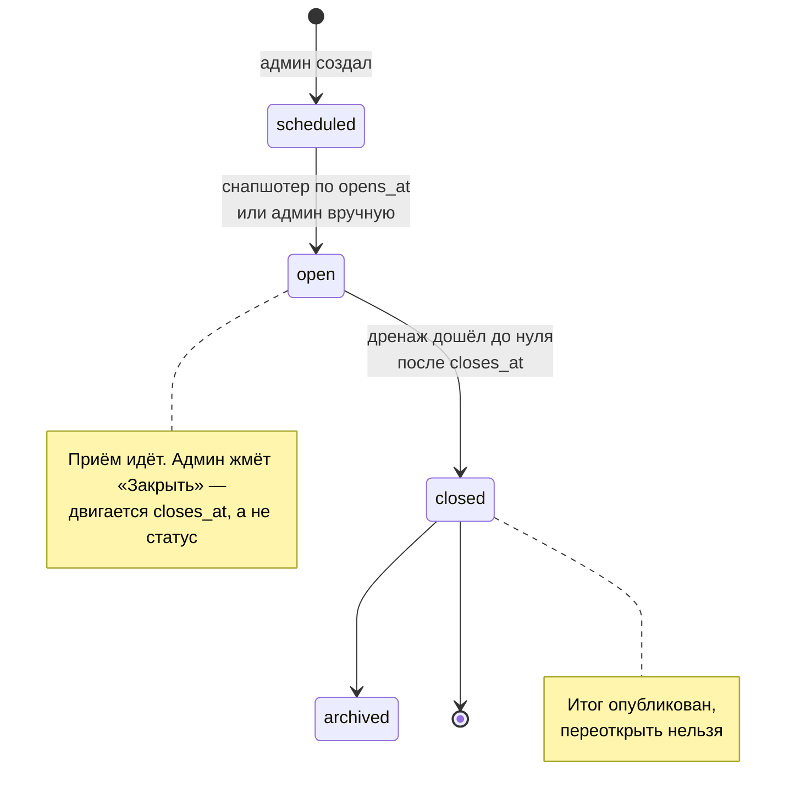

# Televote

Анонимное голосование под пик ТВ-эфира: минутный ролик, 100 млн зрителей,
QR-код на экране. Без регистрации, с дедупликацией.

## Запуск

```bash
make demo
```

```
Голосование   http://localhost:8080/p/demo
QR-код        http://localhost:8080/p/demo/qr.png
Админка       http://localhost:8080/admin      admin / dev-only-change-me
Grafana       http://localhost:3000/d/televote
```

Нужен Docker с 6 ГБ памяти и порты 8080–8082, 3000, 55432. Порт занят —
`APP_PORT=9090 make demo`. Остановить: `make down`.

```bash
make smoke              # дедуп между двумя инстансами
make test               # unit с детектором гонок
make test-integration   # Postgres и Lua-скрипт на настоящем Redis
make load               # k6: стоимость голоса и сверка агрегата
make chaos              # отказ Redis, ребаланс консьюмеров, падение Postgres
make lint               # golangci-lint в докере, версия из CI
```

`make smoke` доказывает главное требование ТЗ: один голосующий шлёт голос на два
разных инстанса, в результатах оказывается ровно один. `make load` и `make chaos`
заканчиваются сверкой счётчиков с числом принятых голосов.

## Архитектура



**ТЗ не требует, чтобы результат был виден сразу.** Значит в окне эфира жёстко
требуется одно: принять голоса и не потерять. Дедуп и подсчёт отложимы — это и
определило форму системы.

| | Синхронный подсчёт | Приём в Kafka |
|---|---|---|
| Мастеров Redis | 32 | **3** |
| Подов приёма | ~100 | **29** |
| Отказ Redis на минуту | **потерянный эфир** | поздний результат |

На горячем пути только приём: разбор JSON, HMAC-SHA256 и запись в батч
продюсера. Ни Redis, ни Postgres на нём нет, поэтому их отказ не останавливает
голосование. Ёмкость считает `domain.CapacityFor` из `expected_audience`:
дренаж за 5 минут — 3 мастера Redis, за минуту — 13.

**Голос — инкремент, а не строка.** Нужен обезличенный агрегат, поэтому 30 млн
голосов — это счётчики по числу вариантов. Отдельных голосов нет нигде, связь
«человек → выбор» неоткуда взять. Цена: пересчитать результат позже нельзя.

**Один атомарный Lua-вызов** — дедуп и инкремент вместе:

```lua
if redis.call('SET', KEYS[1], '1', 'NX', 'EX', ARGV[1]) == false then return 2 end
for i = 2, #ARGV do redis.call('HINCRBY', KEYS[2], ARGV[i], 1) end
redis.call('HINCRBY', KEYS[2], 'b', 1)
redis.call('EXPIRE', KEYS[2], ARGV[1])
```

Отсюда корректность при любой балансировке, один RTT вместо двух и
идемпотентность. Последнее обязательно: Kafka доставляет at-least-once, и без
неё каждый ребаланс завышал бы результат. Дедуп-ключ и счётчик лежат в одном
слоте благодаря общему hash tag `{p:<pollID>:s<shard>}` — иначе `EVALSHA`
вернёт `CROSSSLOT`, и голос пропадёт молча.

### Жизненный цикл опроса



Закрытие двигает границу окна, а не статус: приём прекращается сразу, статус
переводит снапшотер вместе с публикацией итога. Прямой перевод в `closed`
выбросил бы опрос из выборки снапшотера, и голоса последних секунд пропали бы.

### Устойчивость

| Отказ | Что происходит |
|---|---|
| Redis недоступен | приём продолжается, голоса ждут в Kafka, консьюмер ретраит |
| Redis отказывает подряд | circuit breaker размыкает цепь, повтор позже |
| Postgres недоступен | приём его не касается, кэш конфигов на последнем снимке |
| Kafka недоступна | `503` с `Retry-After` — клиенту не врут |
| Реплика консьюмера упала | ребаланс переигрывает, идемпотентность не даёт удвоить |

Временная ошибка Redis никогда не приводит к потере голоса: консьюмер ретраит,
пока жив контекст, и держит партицию. Держать партицию лучше, чем потерять голос.

`/livez` — процесс жив. `/readyz` — проверяет зависимости роли: у приёма это
Kafka, у консьюмера и снапшотера — Redis и Postgres. Приём остаётся готовым при
упавшем Postgres, иначе его падение увело бы все поды из балансировщика. Каждая
строка таблицы проверяется `make chaos`.

**Автоскейлинг** — про Kubernetes, на docker-compose его нет: стенд поднимает
фиксированные реплики. Сервис отдаёт `/internal/capacity`, по которому скейлит
KEDA; к приёму автоскейлинг неприменим в принципе — петля HPA от 60 секунд до
трёх минут, а ролик длится 60, поэтому ёмкость поднимается по расписанию эфира.

### Структура

```
cmd/{api,consumer,snapshot,migrate}

internal/
  domain     сущности, правила выбора, FSM статусов, агрегат, расчёт ёмкости
  service    vote, consumer, snapshot, pollcfg, capacity, auth
  adapter    httpapi, producer, postgres
  platform   app, config, metrics, observability, health, httpx
```

Зависимости направлены внутрь: `internal/domain` не импортирует ничего из
проекта, это проверяет `depguard`. Три роли — три бинаря, у них разные законы
масштабирования: приём растёт под пик эфира, консьюмеры — под consumer lag,
снапшотер не растёт вообще. Стенд поднимает ту же топологию.

Моки генерирует `mockgen` (`make mocks`), тесты на них проверяют взаимодействие:
сколько раз консьюмер сходил в Redis, дождался ли конфига вместо того чтобы
выбросить голос, перестал ли ходить после открытия брейкера. Код без
комментариев намеренно.

Не написано своими руками: пайплайнинг Redis, батчинг продюсера, пул соединений,
rate limiter, argon2, graceful shutdown. Стек: Go 1.26, `franz-go`, `rueidis`,
`pgx/v5`, `chi`, OpenTelemetry → `grafana/otel-lgtm`.

## API

**`GET /api/v1/polls/{slug}`** — вопрос и варианты, кэшируется на CDN. Отдаёт
`server_time`: у зрителя часы могут врать.

**`POST /api/v1/polls/{slug}/vote`**

```bash
curl -X POST localhost:8080/api/v1/polls/demo/vote \
  -H 'Content-Type: application/json' \
  -d '{"choices":[1],"voter":"6f8a4c2e-1a3d-4b5c-8d7e-0f1a2b3c4d5e"}'
```

`voter` — случайный идентификатор из `localStorage`. Сервер выводит из него ключ
дедупа, хэшируя солью опроса. Ответ — `202 accepted`, а не `200`: голос принят к
обработке, посчитает его консьюмер.

**`GET /p/{slug}`** — страница голосования, 2.5 КБ gzip.
**`GET /p/{slug}/qr.png`** — QR-код для экрана.

Админские методы требуют `Authorization: Bearer <token>` из `POST /admin/login`:
`GET|POST /admin/polls`, `POST /admin/polls/{slug}/open|close`,
`GET /admin/polls/{slug}/results`. Результаты возвращают `final: false`, пока
идёт подсчёт. Проценты считаются от числа бюллетеней, а не от суммы голосов: при
множественном выборе сумма больше числа проголосовавших.

| Код | Когда |
|---|---|
| `202` | голос принят к обработке |
| `400` | нарушены `min/max`, неверный индекс, битый `voter` |
| `401` / `403` | нет токена / адрес из датацентрового диапазона |
| `404` / `409` | опроса нет / голос вне окна |
| `429` / `503` | превышена частота / Kafka недоступна |

## Дедупликация

| Слой | Останавливает | Обходится |
|---|---|---|
| `localStorage` + хэш солью опроса | F5, закрытие вкладки, двойной клик | инкогнито, другой браузер |
| `SET NX` в Lua | повтор тем же идентификатором | новым идентификатором |
| Лимит частоты по префиксу /64 | наивный скрипт | прокси |
| ASN-фильтр датацентров | скрипт с VPS | резидентные прокси |

ТЗ просит защиту «на уровне обычных, не технически подкованных пользователей».
Слои останавливают человека с F5 и вкладкой инкогнито, но не скрипт на двадцать
строк — это соответствие требованию, а не недоработка.

**Fingerprint не используется** ни как ключ, ни как сигнал: 18 бит энтропии
против 30 млн голосующих дают потерю 99 %, причём отказы смещены по демографии.

## Допущения

- **Конверсия 30 %** — в ТЗ её нет. Задаётся пер-опрос полем `expected_audience`,
  а не константой: ошибка меняет число нод, а не решения.
- **Результат нужен eventually** — ТЗ не задаёт времени. Дренаж 5 минут.
- **Половина трафика в первые 15 секунд** — зрители сканируют QR сразу.
- **Один регион.** Глобальное распределение — это CDN и edge.

## Наблюдаемость

`GET /metrics`, трейсы и логи по OTLP. Дашборд заводится сам, восемь панелей:
<http://localhost:3000/d/televote>.

| Метрика | Смысл |
|---|---|
| `televote_votes_accepted_total` | принято на входе |
| `televote_votes_rejected_total` | отвергнуто, лейбл `reason` |
| `televote_votes_counted_total` | `counted` / `already_counted` |
| `televote_produce_duration_seconds` | бюджет ответа клиенту |
| `televote_apply_duration_seconds` | один `EVALSHA` в Redis |
| `televote_consumer_lag` | ноль означает конец дренажа |
| `televote_ballots_total` | бюллетеней в последнем снимке |
| `televote_http_requests_total`, `..._duration_seconds` | запросы по маршруту |
| `televote_redis_breaker_open` | брейкер перед Redis разомкнут |
| `televote_poll_config_age_seconds` | возраст последнего обновления конфигов |

Мидлвари на каждом запросе: трейсинг (спан на маршрут), защита от паник,
HTTP-метрики, security-заголовки, клиентский IP с проверкой доверенных прокси,
лимит частоты, ASN-фильтр. Лога на каждый запрос намеренно нет: при 2M RPS это
терабайты — в лог идут только ошибки и отклонённые голоса. Трейс сшивает приём и
подсчёт: контекст едет в заголовках записи Kafka, поэтому HTTP-запрос и
применение голоса в Redis минутами позже видны одним трейсом.

## Нагрузочный тест

Прогон на ноутбуке, генератор делит CPU с сервисом — цифры нижняя граница:

```
принято 19 000 · посчитано 19 000 · потерь нет
RPS ~310 (упирается в генератор) · p50 0.5 · p95 0.9 · p99 1.6 мс
```

Главное не RPS, а сходимость: потерю в цепочке «приём → Kafka → консьюмер →
Redis → снапшот → Postgres» тест на латентность не увидел бы — все запросы
вернули бы 202, а голоса тихо не доехали бы. Переносится не абсолютный RPS, а
стоимость единицы работы: отсюда линейно 29 подов на 2M RPS.

Не проверено: реальные 2M RPS (нужен кластер), потолок Lua в Redis, ложные
failover при `cluster-node-timeout 5s`.

## Что можно улучшить

- **Приём на CDN edge** — `/vote` не имеет состояния до Kafka.
- **Turnstile** — единственное, что меняет порядок стоимости накрутки; не взят,
  добавляет зависимость от Cloudflare.
- **Real-time на студийном экране** — потребует SSE и синхронного подсчёта.
- **k8s-манифесты** — KEDA и Karpenter описаны, `/internal/capacity` реализован,
  но YAML не написан: непроверенный манифест хуже отсутствующего.

## Артефакты работы с ИИ

Проектирование шло диалогом с Claude Opus: разбор ТЗ, расчёты нагрузки, перебор
вариантов, поиск корнер-кейсов. Часть кода написана агентами по плану, часть —
вручную по уже написанным тестам.

**Где рассуждение ошибалось.** Первая версия при недоступности Redis складывала
голоса в память инстанса и отвечала `200`: буфер волатилен, OOM уносит его
целиком — а человеку уже сказали, что голос учтён. Заменено на Kafka. Конфиг
опроса предлагалось держать в Redis — пересчёт показал 50 запросов в секунду к
реплике Postgres, кэш не нужен. Отдельная ручка выдачи токена не покупала
ничего, чего не даёт серверная метка Kafka. Fingerprint отвергнут дважды.

**Что нашли инструменты, а не рассуждение.** Нагрузочный тест нашёл потерю
голосов: консьюмер отбрасывал сообщение, если кэш конфигов ещё не знал про
свежесозданный опрос, — и коммитил оффсет. Сквозной прогон в браузере нашёл, что
результаты закрытого опроса отдавали 500. Ревью кода нашло, что `IsRetryable` не
распознавал `-READONLY` и `-OOM`: при failover мастера Redis голоса выбрасывались
без ретрая. CI поймал то, что не воспроизводилось локально: `make demo` не ждал
балансировщик и падал на холодной машине.
